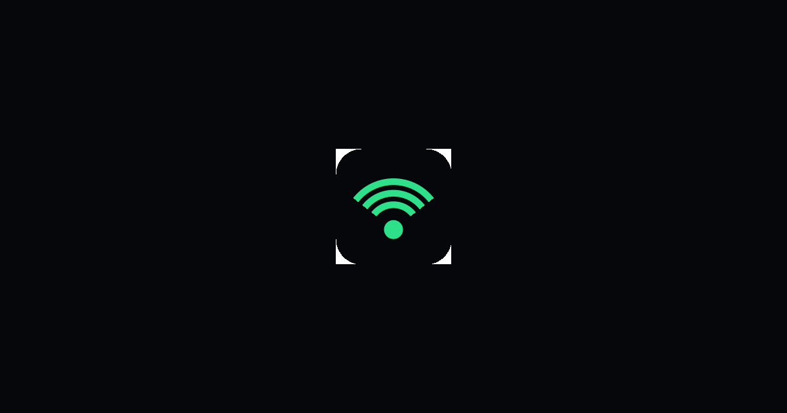

# Radio Melody

**Spin a globe. Tap a glowing dot. Hear that city's radio.**

Live radio from more than 50,000 stations worldwide — free, no signup, nothing to install.

## ▶️ [Open Radio Melody and start listening](https://rakeshnirzari1.github.io/Radio-Melody/)

Works in any browser on iPhone, iPad, Android, Windows or Mac.

### Put it on your home screen (about 30 seconds)

- **iPhone / iPad** — open the link in Safari, tap **Share**, then **Add to Home Screen**
- **Android** — open the link in Chrome, tap the **⋮** menu, then **Install app**
- **Desktop** — the little install icon at the right of the address bar

It then opens full-screen with its own icon and name, and your lock screen and car
buttons control it like any music app.

---

## What's inside

### 🌍 The globe

- Thousands of stations pinned to their home city — spin it, zoom in, tap any dot to
  play that place's radio
- Dots are coloured by what they play, so news, jazz and dance music are easy to pick out
- **Spin the globe** throws you somewhere random when you can't decide

### 🎧 Finding something to listen to

- **Explore** — every country, with its flag and how many stations it has
- **Trending** — what the world has been listening to in the last 24 hours
- **Genres** — Pop, Rock, Jazz, News, Lo-fi, Classical, Electronic, Hip-Hop, Reggae
- **Collections** — "80s Drive", "Bollywood Morning", "Late Night Jazz", "World News Now"
- **Search** — station, city, country or tag, across the whole catalogue

### ❤️ Making it yours

- **Favourites** — save a station with one tap, and keep a backup so you can move your
  list to a new phone
- **History** — jump back to whatever you were listening to earlier
- **Share** — send a station to a friend as a QR code or a picture

### 🚗 Built for the car and the locked phone

- Next and Previous keep working from your **lock screen, Control Centre and your car's
  Bluetooth buttons** — the app won't leave a gap of silence, because that's what makes
  phones drop the player
- Changing station is seamless: what you're listening to keeps playing while the next
  one loads, and a station that isn't working is quietly skipped
- If a signal starts struggling the app tells you, and **Next picks a stronger one**
- **Driving mode** — three huge buttons, a clock and voice commands ("next station",
  "louder", "driving mode")
- **Chromecast and AirPlay** when you're at home

### 🌙 Little touches that make it a keeper

- **Sleep timer** — fall asleep to the radio and let it fade out by itself
- **Wake-up alarm** — start the day with a station from the other side of the world
- **Around the World** — counts the countries you've actually listened to
- **No accounts and no tracking** — nothing to sign up for, nothing to remember

---

## How it stays free

One short advert every 20 minutes pays for it. The radio keeps playing quietly
underneath the advert, so nothing stutters or drops out — and it's back to full volume
the moment the advert ends.

## Common questions

**Do I need an account?** No. There's nothing to sign up for, and no app to download.

**Does it work on my phone?** Yes — iPhone, iPad and Android, on Safari, Chrome or
Firefox. It also runs on Windows and Mac.

**Will it keep playing with the screen off?** Yes, and the controls on your lock screen
and car stereo keep working.

**Where do the stations come from?** A free, community-run catalogue called
[Radio-Browser](https://www.radio-browser.info/), with stations added and maintained by
listeners around the world.

**Can I listen offline?** No — this is live radio, so it needs a connection.

**Something won't play.** Try the next station; a few streams are down at any moment.
The app remembers which ones don't work on your connection and avoids them.

---

## About this repository

This is where Radio Melody is published. The best way to use it is the website:

**▶️ https://rakeshnirzari1.github.io/Radio-Melody/**

It's always the current version, needs no setup, and works on any device you open it on.
If you enjoy it, the kindest thing you can do is send the link to someone who'd like it.

---

Radio Melody · [rakeshnirzari1.github.io/Radio-Melody](https://rakeshnirzari1.github.io/Radio-Melody/) ·
Station data from the community-run [Radio-Browser](https://www.radio-browser.info/) catalogue.
